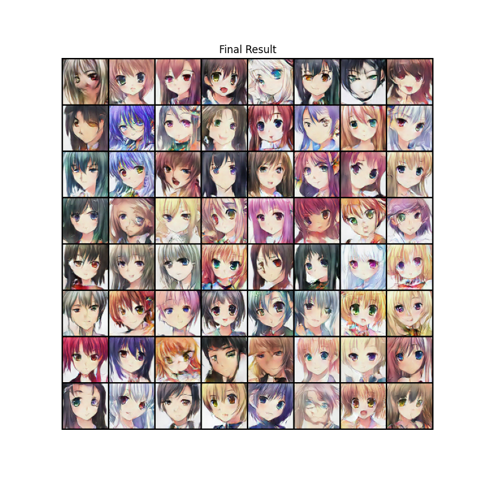
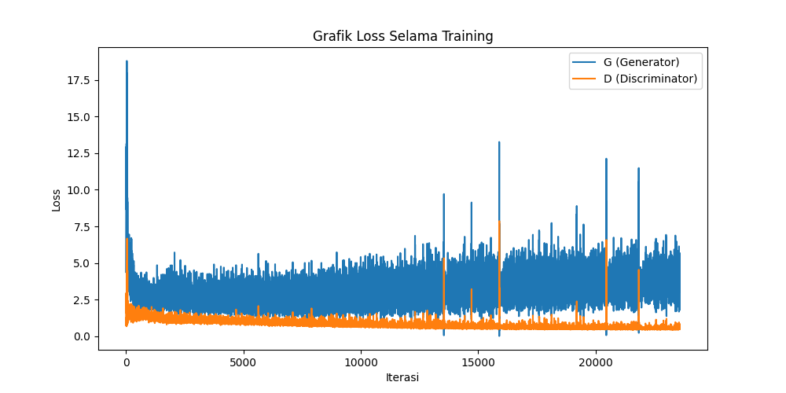

# Optimized DCGAN for Anime Face Generation 🎨

> **Final Project - Artificial Intelligence (SCPMK 1642107)**
> Implementasi **Deep Convolutional GAN** yang dioptimalkan menggunakan **5 Teknik State-of-the-Art** dari paper ilmiah internasional.

Repository ini berisi implementasi DCGAN untuk men-generate wajah karakter anime. Tidak seperti implementasi standar, model ini telah dimodifikasi secara ekstensif untuk mengatasi masalah umum GAN seperti *Mode Collapse*, *Vanishing Gradient*, dan *Overfitting* pada Discriminator.

---

## 🚀 Fitur Utama & Kajian Paper (Optimasi)

Model ini dibangun berdasarkan arsitektur dasar Radford et al., namun ditingkatkan kinerjanya menggunakan metode berikut:

| No | Metode / Teknik | Referensi Paper | Implementasi pada Kode |
| :-- | :-- | :-- | :-- |
| 1 | **TTUR (Two Time-Scale Update Rule)** | *Heusel et al. (2017)* | **Learning Rate Asimetris:** Generator (0.0004) dibuat belajar **4x lebih cepat** daripada Discriminator (0.0001) untuk mengimbangi performa. |
| 2 | **Spectral Normalization** | *Miyato et al. (2018)* | Diterapkan pada setiap layer **Discriminator** untuk menstabilkan training dan mencegah gradien meledak. |
| 3 | **One-Sided Label Smoothing** | *Salimans et al. (2016)* | Target label gambar asli diubah dari **1.0** menjadi **0.9** untuk mencegah Discriminator menjadi *overconfident*. |
| 4 | **Instance Noise Injection** | *Sønderby et al. (2016)* | Menambahkan **Gaussian Noise** pada input gambar asli untuk mempersulit Discriminator membedakan fitur di awal training. |
| 5 | **Dropout Regularization** | *Srivastava et al. (2014)* | **(MVP Feature)** Menambahkan `nn.Dropout(0.5)` pada Discriminator untuk mematikan 50% neuron secara acak, memaksa model mencapai **Nash Equilibrium**. |

---

## ⚙️ Spesifikasi Teknis (Hyperparameters)

Berikut adalah konfigurasi final yang menghasilkan gambar terbaik:

* **Image Size:** 64x64 (RGB)
* **Batch Size:** 128
* **Optimizer:** Adam (`beta1=0.5`, `beta2=0.999`)
* **Learning Rate G:** `0.0004` (Fast Learner)
* **Learning Rate D:** `0.0001` (Slow Learner)
* **Dropout Rate:** `0.5` (Aggressive Regularization)
* **Label Smoothing:** Real = `0.9`, Fake = `0.0`
* **Epochs:** 70

---

## 📊 Hasil Training & Analisis

Berikut adalah perbandingan hasil generate model:

| Epoch 1 (Awal) | Epoch 70 (Final - Nash Equilibrium) |
| :---: | :---: |
|  |  |
*(Gambar kiri: Noise awal. Gambar kanan: Wajah anime tajam hasil training 70 Epoch)*

### 📈 Analisis Grafik Loss


> **Analisis Kritis:**
> Berkat penerapan **Dropout 0.5** dan **TTUR**, model berhasil mencapai kondisi **Nash Equilibrium**.
> * Grafik **Loss Discriminator** tidak lagi mendekati 0 (yang menandakan overfitting), melainkan stabil di angka **~0.69 (log 2)**.
> * Akurasi Discriminator berhasil ditekan dari **96% (Overfit)** menjadi **~50% (Ideal)**.
> * Hal ini membuktikan bahwa Generator berhasil menghasilkan citra yang sangat realistis sehingga Discriminator kesulitan membedakan antara gambar asli dan palsu (probabilitas tebakan 50:50).

---

## 📂 Dataset

Dataset yang digunakan adalah kumpulan wajah anime yang telah di-crop.
* **Sumber:** [Kaggle - Anime Faces](https://www.kaggle.com/datasets/soumikrakshit/anime-faces)
* **Resolusi:** 64x64 pixel
* **Preprocessing:** Normalisasi Range `[-1, 1]`.

---

## 🛠️ Requirements & Instalasi

Project ini dikembangkan menggunakan Python 3.10 di lingkungan Windows dengan dukungan GPU (CUDA).

### Cara Instalasi

1.  **Clone repository ini:**
    ```bash
    git clone [https://github.com/bagoongyoo/Artificial_Intellegence.git](https://github.com/bagoongyoo/Artificial_Intellegence.git)
    cd Artificial_Intellegence
    ```

2.  **Buat Virtual Environment (Opsional tapi Recommended):**
    ```bash
    python -m venv .venv
    # Windows:
    .\.venv\Scripts\activate
    # Mac/Linux:
    source .venv/bin/activate
    ```

3.  **Install Dependencies:**
    Jalankan perintah berikut untuk menginstall library yang dibutuhkan:
    ```bash
    pip install -r requirements.txt
    ```
    *(Pastikan file `requirements.txt` sudah ada di folder project. Isi utamanya: `torch`, `torchvision`, `matplotlib`, `numpy`)*

## 🚀 Cara Menjalankan

1.  Pastikan file dataset `anime_faces.zip` sudah berada di dalam folder project (dan diekstrak sesuai path di notebook).
2.  Buka file notebook **`DCGAN_Anime.ipynb`** menggunakan VS Code atau Jupyter Notebook.
3.  Pastikan kernel yang dipilih adalah `.venv`.
4.  Jalankan cell secara berurutan (*Run All*).

**Catatan Khusus Pengguna Windows:**
Pada konfigurasi `DataLoader`, parameter `num_workers` diset ke `0` untuk menghindari error *BrokenPipe* atau *Multiprocessing* yang umum terjadi pada OS Windows.
```python
workers = 0